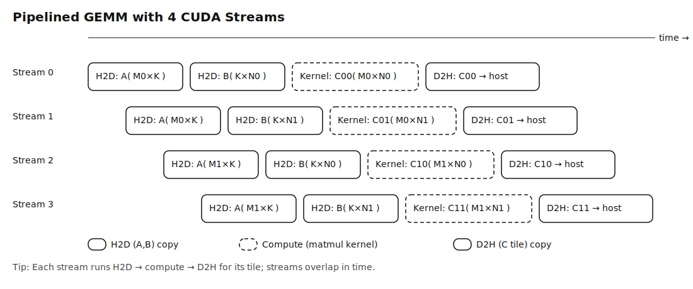

# Pipelined Matrix Multiply (CUDA Streams)

This example shows how to **overlap Host↔Device transfers and compute** using
**four CUDA streams** and **2D async copies** (`cudaMemcpy2DAsync`). The output
matrix `C(M×N)` is split into four tiles; each tile runs in its own stream:

- H2D: copy the corresponding `A` submatrix (`M?×K`) and `B` submatrix (`K×N?`)
- Compute: launch a simple GEMM kernel for that `C` tile (`M?×N?`)
- D2H: copy the `C` tile back into its position in the host matrix

## Why 2D copies?
Row-major tiles aren’t contiguous. `cudaMemcpy2DAsync` lets us copy rectangular
regions efficiently using **width-in-bytes** and **pitches** (leading dimensions).

## What this demonstrates
- **Pinned host memory** (`cudaMallocHost`) enabling true async transfers
- **Multi-stream overlap** (4 streams) of H2D, compute, and D2H
- A tiny **RAII** device buffer wrapper (`DeviceArray`)
- Clear handling of **pitches** for both H2D and D2H copies

## How to reason about correctness
With the provided initialization (`A = 1`, `B = 2`), every output element is:
```
C[i,j] = Σ_k A[i,k] * B[k,j] = K * (1*2) = 2*K
```
For `K = 500`, expect:
```
C[0,0] = 1000
C[last,last] = 1000
```

## File
- `matmul_streams.cu` — single-file example (streams + 2D async copies + naive GEMM)

## Notes
- Inputs in the kernel can be marked `const __restrict__` for clarity.
- `toDevice`/`toHost` use **pitches** carefully:
  - device tile pitch = tile width (`N0` or `N1`)
  - host full pitch = `N`
- Synchronize streams before reading from `hC`.

## Optional future extensions
- Shared-memory tiled GEMM kernel (16×16 or 32×32)
- Small CPU reference check & simple error macros
- NVTX ranges to visualize overlap in Nsight Systems


## Diagram

The timing diagram below illustrates the four independent streams. Each performs
H2D → compute → D2H for its tile; the streams overlap in time.


